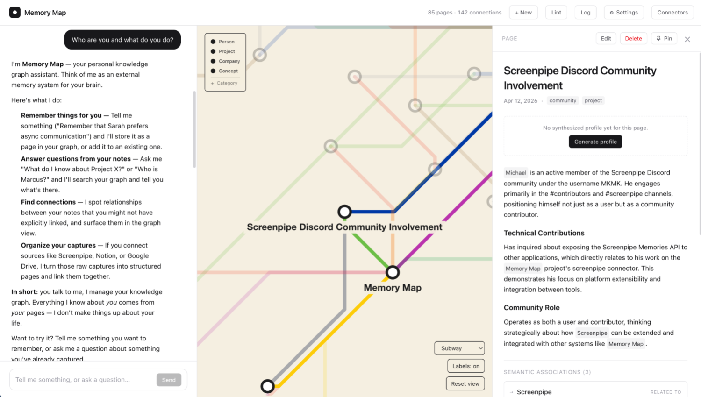
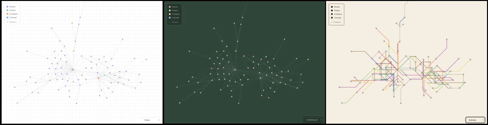
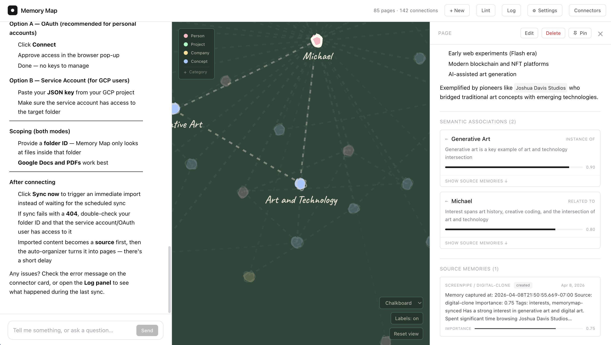
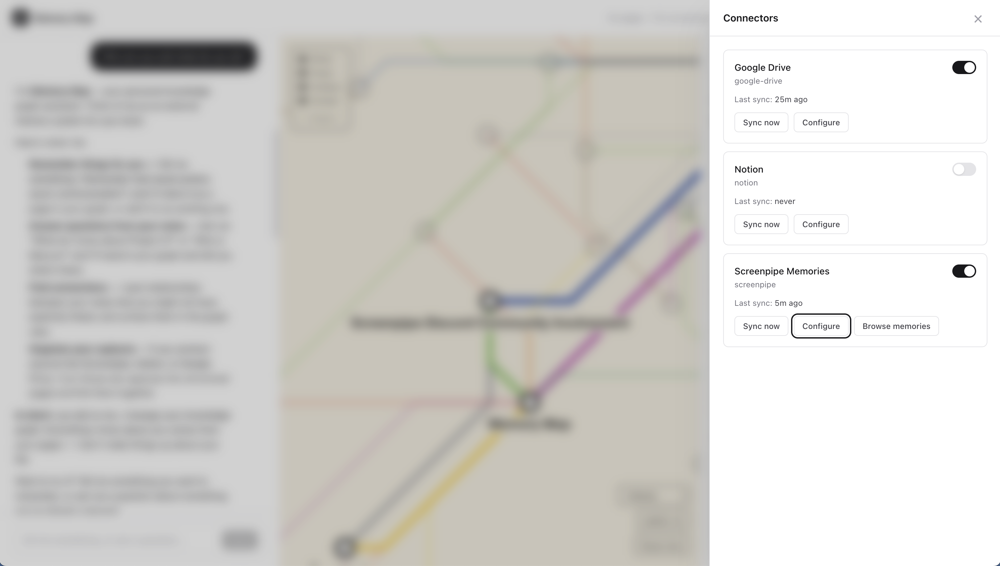

# Memory Map

**A personal knowledge graph that organizes itself.**

- Memory Map shows you what you have been thinking about and how it all fits together.
- To use Memory Map, install it on your own computer and connect to an LLM and sources of memories. Memory Map will show you the connections between your memories and ideas.
- Today, Memory Map works with Claude models and maps memories you input directly, or that Memory Map imports from Screenpipe, Google Drive, and Notion. Telegram support is coming soon, along with more ways to visualize your memories.
- Memory Map is inspired by tools like Roam Research and Obsidian, but without the manual work of tagging and linking ideas. The LLM does that for you. It is also inspired by the amazing new ways LLMs allow us to learn about ourselves, and is especially suited for use with Screenpipe, the screen recording app that generates memories from your screen activity. Finally, Memory Map recalls a favorite middle school project where over the course of the year, we had to draw different maps of the world, and at the end of the year, draw the whole world from memory. It was a very different way of learning, but instilled in me a love of maps and what you can learn from them. I hope you learn wonderful things from yours.

— Michael

---


*The live graph: pages as nodes, associations as edges. Clicking a node opens the page; the graph pulses when the LLM creates or updates connections.*


*View your memory map in multiple styles, including chalkboard, subway, and more.*


*Pages are plain markdown files on disk with frontmatter. Edit them in any editor — Memory Map re-indexes on the next save.*


*Pull from Screenpipe, Google Drive, and Notion. Each runs on its own schedule and only ingests what you explicitly enable.*

## What you get

- **Chat-first capture.** Tell Memory Map what's on your mind. Claude reads your existing pages and decides what to create, what to update, and how things connect — including *why*, recorded as a reason on each link.
- **Three layers of relationships.** Wikilinks for explicit references, semantic associations for "these things go together because…", and provenance edges back to whatever source the information came from.
- **A live graph.** d3-force physics rendered to canvas, with multiple drawing styles. Click a node to open a page; nodes pulse when they update so you can see the LLM thinking.
- **Plain markdown files on disk.** Frontmatter for IDs and tags, body for content. Edit them in any editor, grep them, version-control them, walk away with them at any time. Nothing is locked inside a proprietary database.
- **Connectors.** Pull from Screenpipe (your local activity stream), Notion, and Google Drive. Telegram coming soon. Each connector runs on its own schedule and only ingests what you explicitly enable.
- **A push-mode pipe for Screenpipe.** Screenpipe users can install the [Memory Map pipe](screenpipe-pipes/memory-map/README.md) inside Screenpipe and push selected memories directly, no Memory Map UI configuration required.
- **Lint and log.** A health-check pass over the whole graph (orphans, contradictions, gaps, stale claims) and a chronological event log of everything that happens.
- **Privacy-first by default.** Binds to `127.0.0.1` only. Generates its own local API key on first run. No telemetry. No hosted version. Your notes never leave your machine except in the LLM prompts you explicitly send.
- **Mobile-friendly.** Works on a phone if you bind to your local network (or use Tailscale / SSH tunnelling).

## Requirements

- **Node.js 22 (LTS).** `better-sqlite3` does not yet have prebuilt binaries for Node 25, and building from source fails against Node 25's V8 headers. If you use Homebrew: `brew install node@22`.
- **pnpm 9+.**
- **An Anthropic API key.** Get one at [console.anthropic.com](https://console.anthropic.com/). Memory Map calls Claude on your behalf — the key stays on your machine.
- **macOS or Linux.** Windows is untested; it may work under WSL.
- **Optional: Screenpipe**, if you want to feed in observations from your screen activity. Memory Map can pull from a running Screenpipe instance, or you can run the companion [push pipe](screenpipe-pipes/memory-map/README.md) inside Screenpipe.

## Install

```bash
git clone https://github.com/michaelkeating/Memory-Map.git
cd Memory-Map
pnpm install
pnpm dev
```

On the first run, the server generates its own local API key and prints it to your terminal in a banner:

```
───────────────────────────────────────────────────────────────
Memory Map: generated new credentials

  API key:  <64-character hex string>

  Open Memory Map in your browser. You'll be asked for this
  key once and the session is remembered for 90 days.
───────────────────────────────────────────────────────────────
```

Open <http://localhost:5173>, paste the key into the login screen once, and you're in for 90 days per browser. The key is also saved to `data/credentials.json` with mode `0600` so you can read it later if you forget.

You'll also want to add your Anthropic API key, which Memory Map needs to think. You can do this either in the UI (**Settings → API key**, recommended) or by setting `ANTHROPIC_API_KEY` in a `.env` file at the repo root. The UI takes precedence if both are set.

## First things to try

Once you're signed in, here's a 5-minute tour:

1. **Add an API key.** Click the **⚙ Settings** button in the header, paste your Anthropic key, click **Test connection**, then **Save**. Until this is done, chat and auto-organizing won't run.
2. **Tell Memory Map something.** In the chat panel: *"Remember that Marcus is a senior engineer at Acme who works on the Vermeer HDD project and prefers morning meetings."* Watch the graph update as Memory Map decides which pages to create.
3. **Ask a question.** *"Who is Marcus?"* or *"What do I know about Acme?"* Memory Map searches your pages first and cites what it finds.
4. **Explore the graph.** Click a node to open the page on the right. Zoom and pan. The graph re-focuses as chat surfaces new pages.
5. **Connect a data source.** Click **Connectors**, pick Google Drive / Notion / Screenpipe, enable, and configure. Click **Sync now** for an immediate first sync. Incoming memories become sources, and the auto-organizer turns them into pages on its own schedule.
6. **Run the linter.** Click **Lint** in the header for a graph health check — duplicates, orphans, stale associations.
7. **Read the log.** Click **Log** to see a chronological record of everything that's happened: ingests, page edits, chat queries.

## Connectors

Each connector is disabled by default. Open **Connectors** in the header, enable the one you want, and fill in its config form.

**Screenpipe** — pulls memories from a locally-running [Screenpipe](https://screenpi.pe) instance at `http://localhost:3030`. Filter by source and tag. There's also a companion [Memory Map pipe](screenpipe-pipes/memory-map/README.md) that runs *inside* Screenpipe and pushes memories to Memory Map. The pull-side connector and the push-side pipe are independent and can be used together.

**Notion** — paste a Notion integration token and a database ID or page root. The integration has to be shared with the target pages from inside Notion before anything flows. If you're seeing "nothing is importing", that's usually why.

**Google Drive** — two auth modes. **OAuth** is friendliest for personal accounts: click **Connect**, approve in the browser, done. **Service account** is for users who already have a GCP project: paste the JSON key, make sure the service account has access to the target folder. Either way, scope imports with a folder ID — Memory Map only looks inside that folder.

**Telegram** — coming soon.

## How it works

```
┌──────────┐  chat   ┌──────────┐  tools  ┌──────────────┐
│  Browser │ ──────► │  Server  │ ──────► │   Claude     │
│ (React)  │ ◄────── │ (Fastify)│ ◄────── │  (Anthropic) │
└──────────┘   WS    └─────┬────┘         └──────────────┘
                           │
                           ▼
                  ┌────────────────┐
                  │ data/          │
                  │  pages/*.md    │
                  │  memory-map.db │
                  └────────────────┘
```

The server is the only thing that touches your data. The browser only talks to the server (over HTTP and a single WebSocket). The server only talks to Anthropic (for LLM calls) and to whichever connectors you explicitly enable (for data ingestion). There is no other outbound network surface. See [SECURITY.md](./SECURITY.md) for the full threat model.

Under the hood:

- **Pages** are markdown files on disk in `data/pages/`. An SQLite index (`data/memory-map.db`) tracks metadata, full-text search, and graph relationships. The files are the source of truth; you can edit them in any editor and Memory Map re-indexes on save.
- **Sources** are the original captured items (a Screenpipe memory, a Google Drive file, a pasted chat turn). The auto-organizer turns sources into pages using Claude.
- **Associations** are weighted, typed edges between pages with an explanation for each. They complement explicit `[[wikilinks]]` inside page content.
- **Profiles** are per-page synthesized summaries generated from all the sources touching that page — handy for pages about people or projects where many raw memories accumulate.

## Privacy & security

Memory Map runs entirely locally and binds to `127.0.0.1` by default. Nothing leaves your machine except (a) the prompts you explicitly send to Claude and (b) the API calls to whichever connectors you've enabled. There is no telemetry, no analytics, and no hosted version.

To make Memory Map reachable from another device on your network (e.g. your phone), set `BIND_LAN=true` in `.env` — the server will then listen on `0.0.0.0` and anyone on your LAN can reach the login page. They'll still need the API key to do anything, but for remote access from outside your network, prefer Tailscale or an SSH tunnel over opening up LAN binding.

For the full threat model, what's protected, what isn't, and how to uninstall cleanly, read [SECURITY.md](./SECURITY.md).

## Configuration

Most configuration lives in the **Settings** panel (API key, model) and the **Connectors** panel (data sources). A few things are set via environment variables at the repo root in `.env`:

| Variable | Default | Notes |
| --- | --- | --- |
| `ANTHROPIC_API_KEY` | — | Bootstrap key. The UI Settings panel overrides this. |
| `DATA_DIR` | `./data` | Where Memory Map stores pages, database, and credentials. |
| `PORT` | `3001` | Server HTTP port. |
| `BIND_LAN` | `false` | Set to `true` to bind on `0.0.0.0` for LAN access. |

## Repository layout

```
packages/
  shared/       # types shared between server and web
  server/       # Fastify, SQLite, LLM, connectors, auth
  web/          # React UI
data/           # generated on first run — pages, db, credentials
screenpipe-pipes/
  memory-map/   # Screenpipe pipe that pushes memories in
docs/
  images/       # README screenshots (GitHub Pages source)
```

## Troubleshooting

- **Chat says "No LLM API key configured."** Open **Settings** and add your Anthropic API key.
- **`better-sqlite3` fails to load with `ERR_DLOPEN_FAILED`.** You're on Node 25 or a version that doesn't match what `better-sqlite3` was built against. Switch to Node 22 and re-run `pnpm install` with Node 22 active.
- **A connector is enabled but nothing imports.** Check the last-sync error on the connector card. Common causes: Notion integration not shared with the target pages; Google Drive folder ID wrong or service account unauthorized; Screenpipe not running at `localhost:3030`.
- **The Screenpipe pipe isn't pushing.** Make sure Memory Map is running (it writes the pipe's API key to `~/.screenpipe/memory-map.key` on startup). Then check `~/.screenpipe/memory-map-rules.json` or tag a memory with `memorymap` in Screenpipe.
- **Build fails with "schema.sql not found".** Run `pnpm build` from the repo root — the build script copies non-TS assets into `dist/` after TypeScript compilation.
- **Graph looks empty.** You don't have any pages yet. Tell Memory Map something in chat, or connect a data source and sync.

## Development

```bash
pnpm install       # install all workspaces
pnpm dev           # run server + web with hot reload
pnpm build         # production build
pnpm typecheck     # type-check all workspaces
```

The monorepo uses pnpm workspaces and Turborepo. `packages/server` is a Fastify app; `packages/web` is a Vite + React app; `packages/shared` holds type definitions both sides use.

## License

[MIT](./LICENSE).
